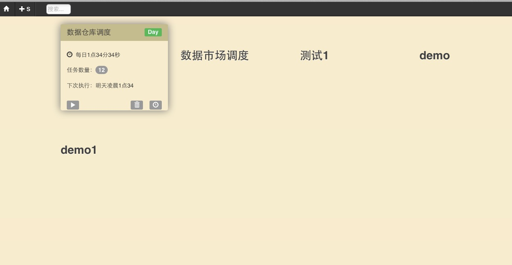
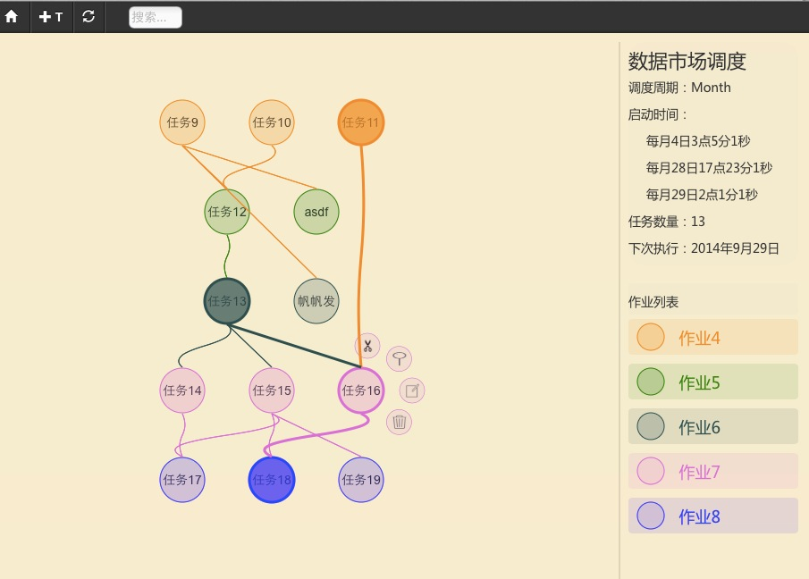

hivego
======

HiveGo是一个分布式的任务调度平台。可以实现管理多个具有依赖关系的任务，并按规则运行它们。提供友好的Web界面来进行任务的管理。

## 编译安装

从源码编译的话需要golang的编译环境和git，golang安装具体可参考[这里](http://golang.org/doc/install)，环境搭建好后，执行下面命令编译：

	go get github.com/rprp/hivego
    cd hivego
    go build

项目中包含的前端代码在web目录下，这部分用CoffeeScript写成。编译的话需要安装node.js环境后执行：

    cd web
    npm install . 
    hem build 

会生成前端代码至web/public目录下。

运行时可将执行文件与web资源转移出来，形成下面的结构。

    .
    ├── hive.toml
    ├── hive_tp.db
    ├── hivego
    ├── log_tp.db
    └── web
        └── public

其中hive.toml是调度系统的配置文件，用来配置资源库信息，web服务端口号等。若使用Sqlite来做资源库，hive_tp.db可以作为初始的模板。
web目录下包含了必要的前端资源。

## 部署运行

hivego运行时分为Server端和Client端。Server端负责任务的管理分发，Client端接受服务端发送来的任务，执行并返回是否成功。
hivego程序同时包含了Server端和Client端，启动时通过参数即可区分。

运行服务端（调度模块）

    ./hivego -s

运行客户端（执行模块），可部署在多机。

    ./hivego

## 配置管理

hivego提供了一个简易的web页面来进行任务的配置管理。服务端启动后访问

    http://host:prot

host为Server端机器地址，prot为hive.toml中配置的web服务端口。

调度列表界面：

任务管理界面：

## 架构

调度平台被设计为三部分，分别由任务执行模块、调度模块、配置管理模块组成。

元数据库存储着调度的规则，任务之间依赖关系以及调度执行情况。元数据库为关系型DB，支持mysql与sqlite。

配置管理模块是一个典型的Web应用程序，它提供了用户与元数据库之间的交互的界面。大多数情况下它接收用户来自浏览器的请求数据，并将其存储到元数据库中。当用户要查看调度执行情况时，从元数据库查询执行日志并返回给用户。当用户手动执行调度或修复执行调度时，它能够将指令存入元数据库并与调度模块通信，发出执行的请求。

调度模块负责读取元数据库中的任务调度规则，并将其分配给执行模块。调度模块与执行模块为C/S结构的设计，同一时间调度模块只会在一台机器上运行，通过RPC方式与执行模块通信。

任务执行模块主要用来执行调度模块分配的任务。任务执行模块被设计为可多语言实现、插件的信息。它与调度模块的通过RPC方式通信。

## 调度结构与流程

文档中所提的名词：

>
1. 任务：任务彼此互相独立，是调度中的最小粒度，可分布在不同机器上，各个任务之间会有依赖关系。
2. 作业：作业彼此之间有上下级关系，主要用来方便任务分组，包含1个或多个任务。单个作业中的任务是并行的。
3. 调度：多个作业会组成一个链表结构，这个结构就是一个调度。只有在调度中才会有何时执行、是否重复执行、执行频率、次数等信息。
4. 批次：周期性重复执行的调度，每一次启动算做一个批次。

调度结构如下图所示：

一个或多个分散独立的任务被包含在单一的作业中，多个作业通过上下级关系组成的链表结构形成一个调度。

一个调度开始执行后，调度模块会读取并遍历全部的任务，找出符合执行条件的任务（依赖列表为空的任务），发送给执行模块执行。当收到执行结束信号后，将其从下级任务的依赖列表中删除，并检查符合执行条件的下级任务，发送给执行模块。依次往复，直至无下级任务。
