hivego
======

过去的许多年中，数据团队在建立数据仓库和提供对外的数据服务的过程中，实现了近千个ETL模块。它们之间有着严格的执行顺序和依赖关系，如:前面的模块执行失败，将导致后续依赖模块的失效。随着模块间的依赖链的增加，恢复执行变的非常复杂和难以管理。另一个问题就是受单机的限制，这并不能充分利用服务器资源，同时全部模块执行效率也十分低下。除此之外，大量的执行模块如何进行管理维护是一个很大的挑战。

为了解决以上问题，HiveGo作为新的调度平台。提供一个更加直观、方便的方式进行管理维护大量的任务。可以实现管理多个具有依赖关系的任务，并按规则运行它们。当某一任务异常时会根据依赖关系自动停止受影响的任务，且人工修复后能方便的从故障点恢复有依赖关系的任务执行。以web界面来进行调度的管理配置，通过任务执行图来显示当前任务执行的情况。

如下图所示：
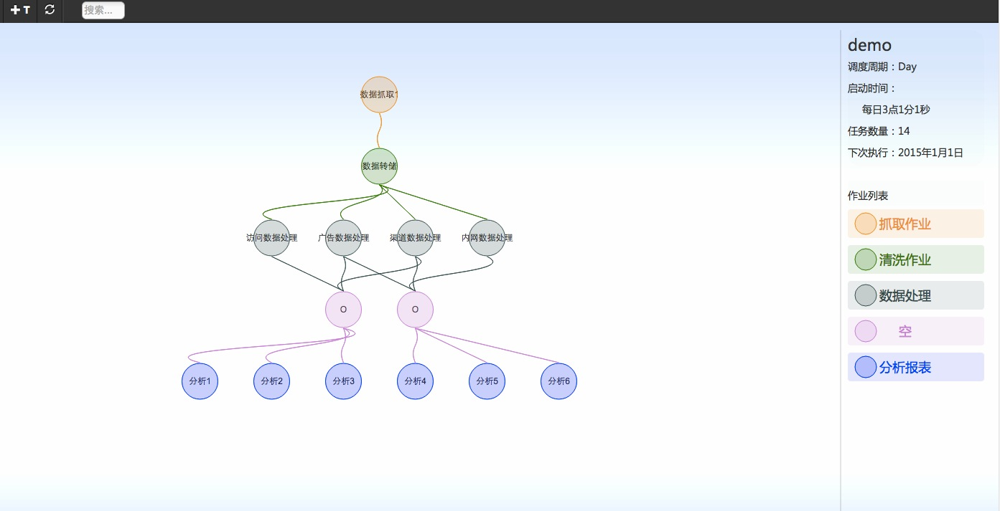

###使用 
>go get github.com/rprp/hivego
>./hive -s

## 架构模型

调度平台被设计为三部分，分别由任务执行模块、调度模块、配置管理模块组成。
如下图所示：
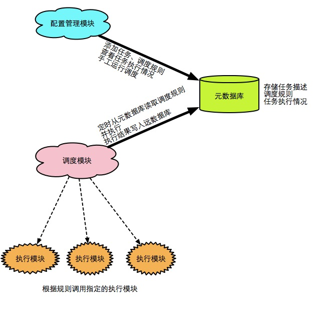

元数据库存储着调度的规则，任务之间依赖关系以及调度执行情况。元数据库为关系型DB，部署的物理位置可以与调度平台分开。用户通过配置界面录入任务设置调度规则这些操作都会记录到元数据库中，调度模块则从元数据库读取这些信息并执行。用户也可通过配置管理模块从元数据库读取任务执行情况。

配置管理模块是一个典型的Web应用程序，它提供了用户与元数据库之间的交互的界面。大多数情况下它接收用户来自浏览器的请求数据，并将其存储到元数据库中。当用户要查看调度执行情况时，从元数据库查询执行日志并返回给用户。当用户手动执行调度或修复执行调度时，它能够将指令存入元数据库并与调度模块通信，发出执行的请求。

调度模块负责读取元数据库中的任务调度规则，并将其分配给执行模块。调度模块与执行模块为C/S结构的设计，同一时间调度模块只会在一台机器上运行，通过RPC方式与执行模块通信。

任务执行模块主要用来执行调度模块分配的任务。任务执行模块被设计为可多语言实现、插件的信息。它与调度模块的通过RPC方式通信，调度模块支持Thrift协议。且调用接口是定义好不变的。我们可以针对脚本、命令行任务开发针对的任务执行模块，对需要执行web server服务的任务开发另一种执行模块。

## 调度逻辑结构与流程

### 调度逻辑结构

在进行下一步前，先介绍一下文档中所提的名词。
1. 任务：任务彼此互相独立，是调度中的最小粒度，会被作业调用执行，各个任务之间可能会有依赖关系，若有依赖的任务未执行或执行失败则该任务不会被执行。
2. 作业：作业彼此之间有上下级关系，串行，即一个作业执行完毕，它下一级作业才会开始执行。作业中包含1个或多个任务。单个作业中的任务是并行的，作业执行时间取决于执行最耗时的那个任务。
3. 调度：多个作业会组成一个链表结构，这个结构就是一个调度。只有在调度中才会有何时执行、是否重复执行、执行频率、次数等信息。
4. 批次：周期性重复执行的调度，每一次启动算做一个批次。

调度结构如下图所示：
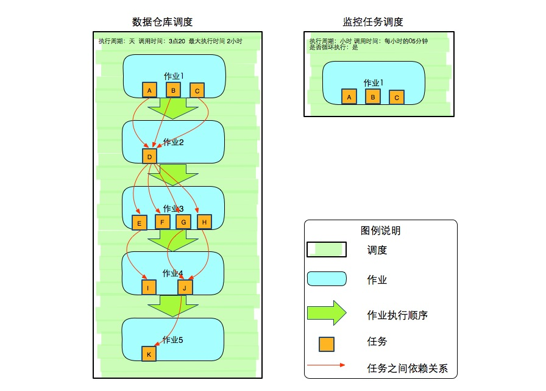
在上面的结构中，一个或多个分散独立的任务被包含在单一的作业中，由作业调用执行。多个作业通过上下级关系确定执行顺序。每个调度中都包含一套由多个作业组成的执行链。

调度中拥有调度名称、执行次数、调度周期、周期内启动时间、最大执行时间这些信息。调度模块会读取并按规则运行调度中的第一个作业。当首个作业执行结束后，调度模块会根据依赖关系继续运行下级作业，直至无下级作业。

作业执行时调度模块会并发执行其包含的任务。

作业中的每一个任务在调用前调度模块都会去检查同一批次中该任务是否满足运行条件，即该任务依赖的其它任务是否都已执行完毕。若满足运行条件则调用，否则略过。

一个任务在一个调度中只能出现一次。但可将同一命令行包装成多个任务。作业中任务执行完成直接执行下一作业的任务，不需等全部任务完成再继续下一作业。配置管理模块能够自动消除多余重复的任务依赖关系。

### 调度流程举例说明

上图中描述了调度平台中的一个调度。数据仓库每日要运行A、B、C、D、E.....J、K等11个任务，每日从3点20开始，分5组也就是5个作业调用。
1. 作业1，包含有3个任务，会同时运行。任务全部完成后，作业1也就完成了，进行下一步。
2. 作业2, 包含有1个任务，且依赖于A、B、C三个任务，调用前检查依赖的任务是否成功完成，若成功则运行任务，若有依赖任务未执行成功则略过。
3. 作业3, 包含有4个任务，依赖于D任务，调用前检查依赖关系，处理同上
4. 作业4，包含2个任务，其中I依赖于E，J依赖于G、H。I仅当它依赖的任务E失败才被忽略，F、G、H任务失败与I无关。J任务的依赖处理同I任务。
5. 作业5，包括1个任务，K依赖J，依赖处理同上。K任务运行结束则作业5和本调度也执行结束。

## 调度模块实现

调度模块是平台的大脑，当它启动后会从元数据库读取调度规则，并将执行指令发送给执行模块。

###数据结构

调度模块由调度和作业两部分组成。

调度中维护着需要调度的信息，信息由配置管理模块维护，也接受调度模块中的接口线程写入调度信息。
结构如下：
调度信息，主要存储调度基础信息。
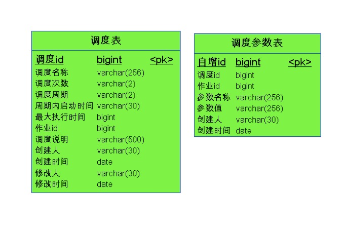

作业及作业与任务映射关系、任务之间依赖关系。
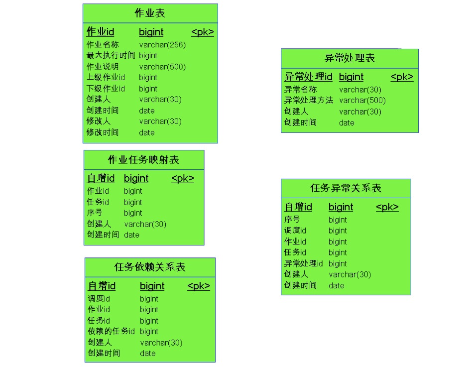

执行情况日志信息。
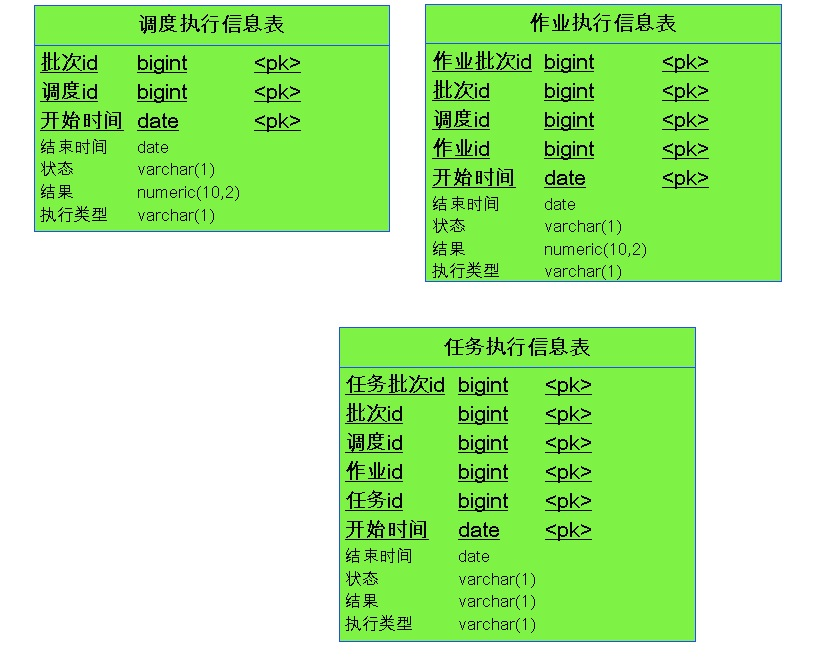

###自动调度的实现

调度模块作为一个daemon程序驻留在后台一直运行。当它启动后会进行下图描述的流程
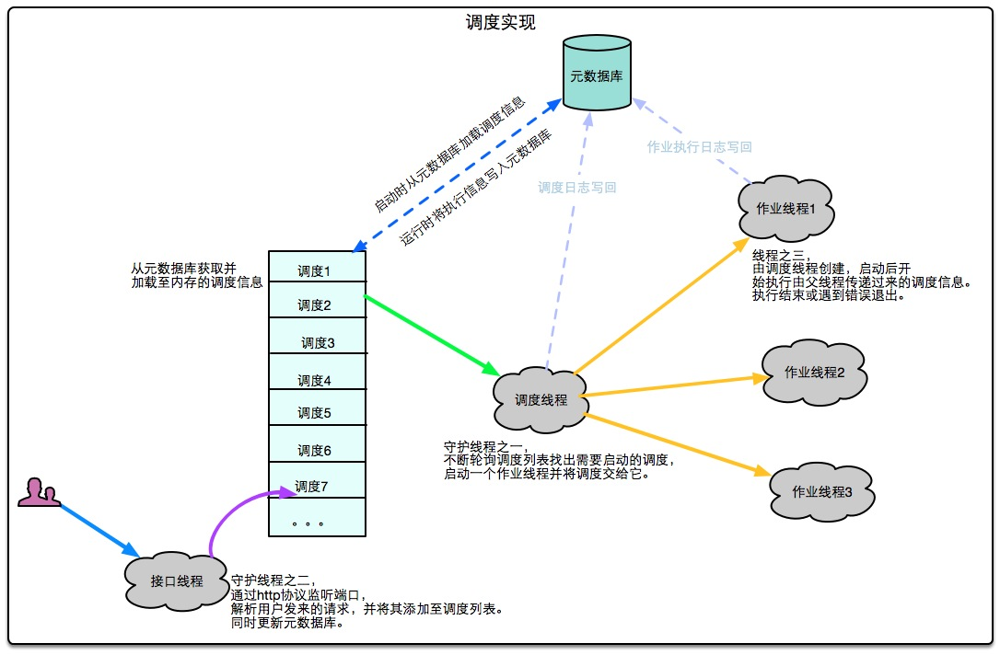
模块运行后会首先从元数据库加载调度信息和执行日志信息。完成后，会启动两个守护线程调度线程和接口线程。
其中调度线程会不断轮询从元数据库加载的调度列表，若发现可以执行的调度，则启动一个作业进程去执行它。
接口线程实际是一个HTTP服务，用户或者配置管理模块将需要调度的信息直接用HTTP协议的POST方法发送到接口线程，后者接受到信息后维护在调度列表并存储至元数据库。
除此之外还有一个作业线程，它是由调度线程创建，执行传递过来的作业，完成或发生错误会退出。
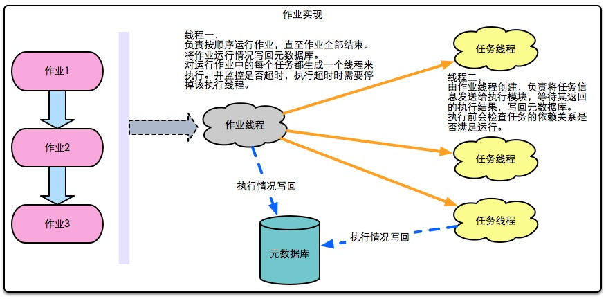
具体到作业线程，它接受从父线程传递过来的作业，对于作业中的每个任务都会生成一个线程来执行。当作业中任务全部结束后，转到下一作业执行，直到作业全部执行完毕或超时。
作业线程会将执行情况实时写入元数据库。
任务线程，由作业线程创建，负责将任务信息发送给执行模块，并等待其返回结果，写入元数据库。

###从断点恢复执行

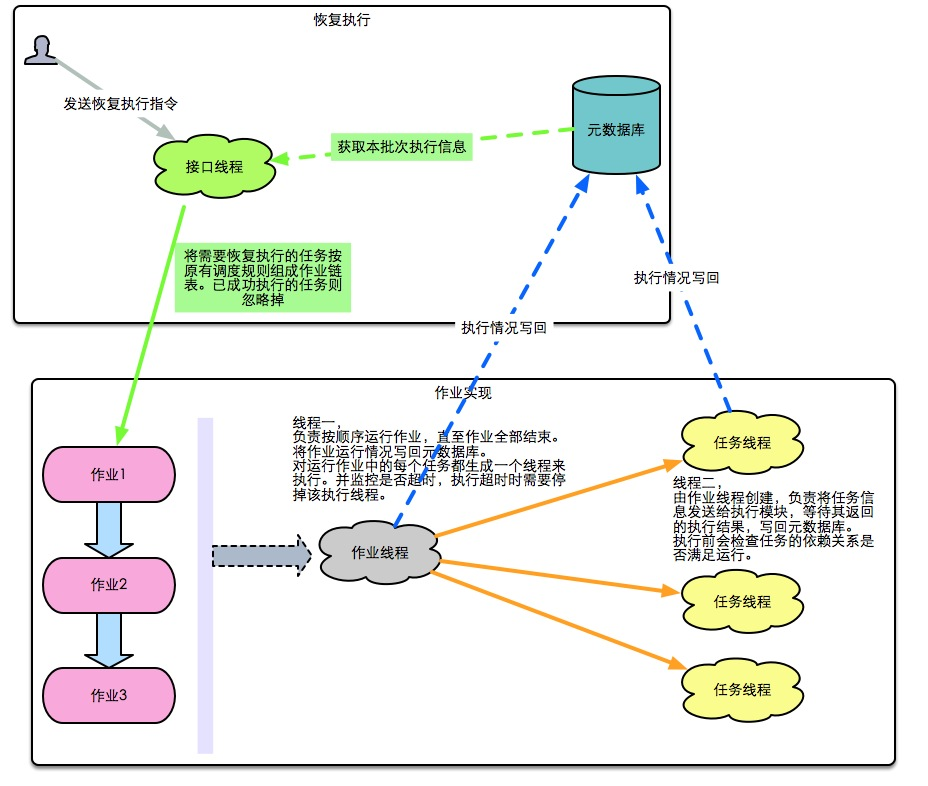
断点恢复执行会省略掉调度，直接从作业开始执行。具体流程：调度执行结束，显示有失败任务，修复任务后。向调度模块发出指令，调度模块根据指令中的批次信息，从元数据库加载此次调度的执行情况，将未执行或执行失败的任务按调度规则重构一个执行作业链表。启动作业线程执行。

###手动调度的实现
手动调度提供了一个可以直接运行任务的功能，与断点恢复类似。调度模块收到指令后，直接启动任务线程去执行。需注意的是手动调度的执行日志中不会记录调度、作业的信息。

###与执行模块通信
调度模块通过RPC调用与执行模块通信，具体实现：执行模块作为后台守护进程被部署在多个机器上。启动后会监听指定端口，执行任务时，调度模块会连接到执行模块上，调用其执行函数，将任务信息传入，并获取返回结果。

## 执行模块实现
执行模块作为一个daemon程序驻留在后台一直运行，监听指定的端口。当收到调度模块指令后启动一个线程在本地执行任务。
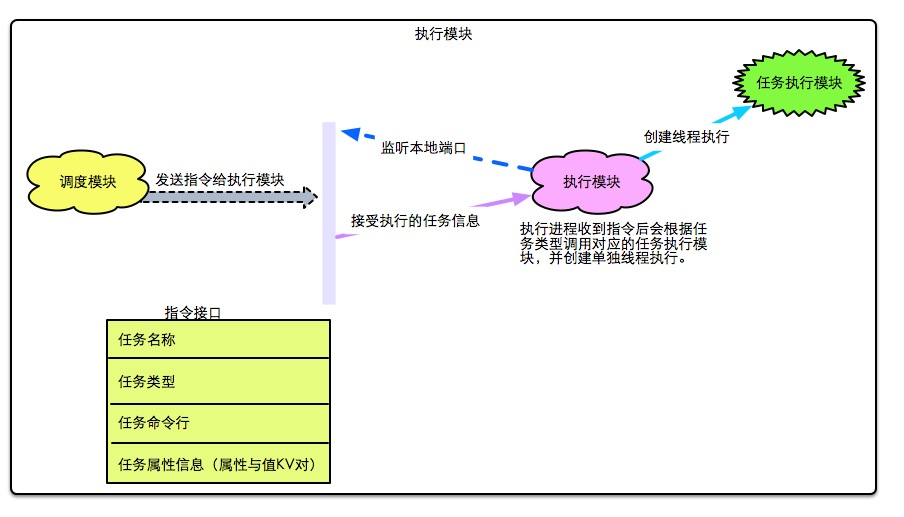

任务的数据结构
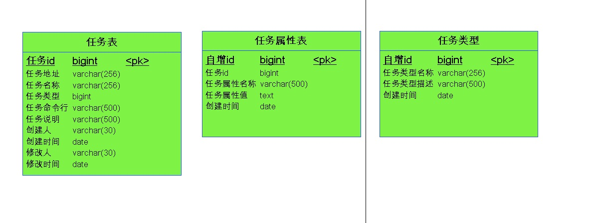

执行模块被设计为可扩展实现。根据不同类型的任务使用不同的模块执行任务。

## 配置管理模块
配置管理模块是一个典型的Web服务，提供调度管理界面给用户操作，并将用户的操作结果存入元数据库中。

主要功能：
1. 调度信息管理界面
2. 作业信息管理界面
3. 任务执行查看界面
